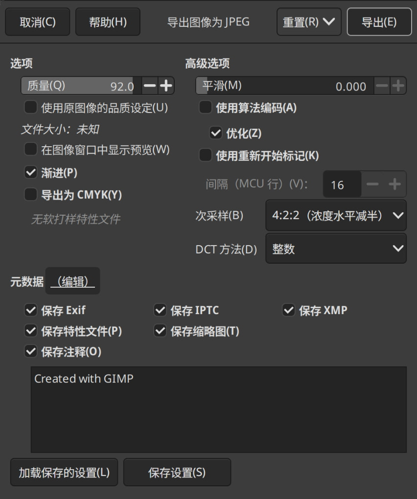

 # 胡闹厨房3.0

本项目会不定时大规模重写历史，如果重写了请自行reset


> [!WARNING]
>
> 对于这种奇奇怪怪的Git用途来说一块还算比较健康的硬盘是刚需(尤其是没有办法开[Git LFS](https://docs.github.com/zh/repositories/working-with-files/managing-large-files/about-git-large-file-storage))。 Git一般没有特别的需求，但是读写能在USB3.0标准速率且能稳定住的速度为佳。 

[](https://debian。org) [](https://debian。org)

## 分支列表

| 名称     | 用处                                                 |    你在何时该选    |
| -------- | ---------------------------------------------------- | :----------------: |
| main     | 主要的分支，用来存放其他分支包含的所有基础的图片文件 | 想一下获取到所有图 |
| selected | 根据一定标准在[横屏壁纸](./横)中筛选出来的文件       |       母鸡啊       |

------

## 克隆方法

目前GitHub的网页浏览和下载已经因为这个仓库严重超载，请**不要**尝试直接下载或从其他镜像站下载，以免对镜像站站长身心造成损失。但是你可以干的是自己本地存一份镜像仓库，以下是简略版的操作方法

### 创建镜像

1. 准备一个至少32G的较为快速的外置存储设备

2. 运行 (在你的外置存储设备上)

   ```bash
   git clone --mirror -j 16 https://github.com/dontknowhy/MyTheme-private.git # 这里的-j参数可以自行修改
   ```

   之后你可以注意到提示的是`克隆到纯仓库 'MyTheme-private.git'...`，这意味着你不能直接看见图片，而是标准`.git`文件夹中的文件。

3. 之后等待下载完成
4. 你就有个本地仓库了

### 克隆本地仓库

可以通过正常的`git clone`指令完成(这里假定你的U盘挂载在`/mnt/udisk`，如果通过图形化挂载请前往`/media/$(whoami)`下查找):

```bash
git clone /mnt/udisk/MyTheme-private.git # 这里可以指定-b克隆指定的分支，因为你的镜像不出意外是完整的
```

之后你可以进入克隆出来的文件夹内设置remote来防止下一次`git fetch`时尝试寻找你的本地克隆:

```bash
git remote set-url origin https://github.com/dontknowhy/MyTheme-private.git
```

最后再pull一下保持最新:

```bash
git pull
```

------

以下是一些瞎写的配置，兴许有用：

```bash
# 这里边还是有些多余的我闲着没事干加上去的配置
git config checkout.workers 20
git config core.compression 9
git config pack.comppression 9
git config pack.threads 20
git config index.threads 20
git config repack.cruftThreads 20
git config http.minSessions 5
git config http.maxRequests 5
git config http.postBuffer 5M
git config http.lowSpeedLimit 0
git config http.lowSpeedTime 999999
git config core.fscache true
git config core.preloadindex true
git config gc.auto 256
git config core.multiPackIndex true
git config pack.useSparse true
```

> [!WARNING]
>
> 这些config有助于减小`.git`文件夹的大小（存疑），所以务必应用完后运行:
>
> ```bash
> git gc --prune=now
> ```
>
> 这样你就会惊喜的发现`.git`文件夹比图片还大，没办法，git天生不适合存储大量图片。

## 维护小贴士

1. 目前开始使用[chaiNNer](https://github.com/chaiNNer-org/chaiNNer)进行统一的AI放大操作，详细流程请参考[该文件](./scripts/process.chn)

8. [sync_metadata.sh](./scripts/sync_metadata.sh)用于拷贝原图片的元数据，如果真的有摄影师看到这的话麻烦在IPTC里边写自己的大名

9. 对GIMP默认行为做了点小变动，包括:

   >1. 使用下面的脚本强行加了个~~我不知道有没有用~~的OpenMP支持:
   >
   >```bash
   >#!/usr/bin/env bash
   >export OMP_NUM_THREADS=20
   >export OPENBLAS_NUM_THREADS=20
   >export OMP_THREAD_LIMIT=30
   >export LD_PRELOAD="libiomp5.so"
   >export KMP_AFFINITY=granularity=fine,compact,1,0
   >export KMP_BLOCKTIME=0
   >export MALLOC_CONF=oversize_threshold:1,background_thread:true,metadata_thp:auto,dirty_decay_ms:9000000000,muzzy_decay_ms:9000000000
   >export LD_LIBRARY_PATH=/usr/local/lib
   >/usr/bin/gimp
   >
   >```
   >
   >2. 自行编译了一份[mozjpeg](https://github.com/mozilla/mozjpeg)放到了`/usr/local/lib`内供GIMP加载
   >3. 
   >4. 缩放图像时选用了`LoHalo(低光晕)`模式，据说能保留更多细节

